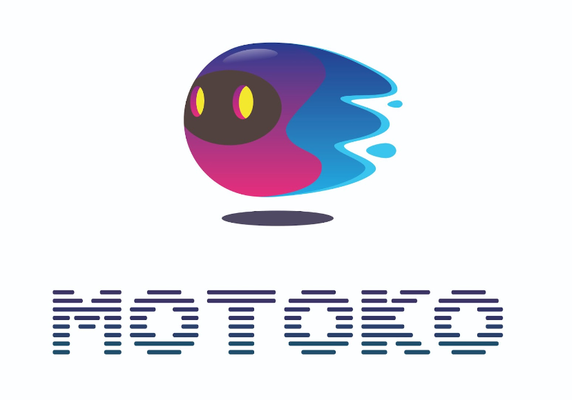
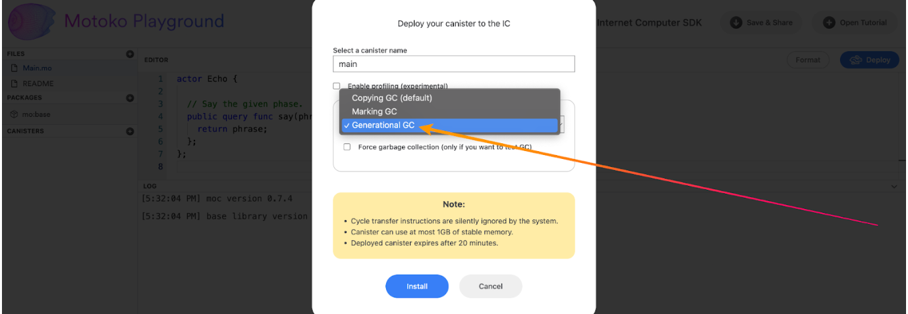

# Motoko Weekly Update Part 2!


Hey Motoko Devs,

The languages team is back with a second weekly update to keep you guys in sync with what we’re working on for Motoko.
You can check out our previous
post [here](https://forum.dfinity.org/t/highlight-post-new-motoko-features-in-dfx-0-12/17027).

As a recap, last time we talked about the new record extension syntax, extended buffer class, and teased the
generational GC that will be coming in the next release of `dfx`.


# Collector now Available on the Motoko Playground!

The new generational garbage collector (GC) has been deployed to
the [Motoko Playground](https://m7sm4-2iaaa-aaaab-qabra-cai.raw.ic0.app/) (thanks to @chenyan)! If you’re curious to try
out the new system, this is a great way to try it out before the official release in the next version of `dfx`.

As a reminder, generational garbage collection allows more efficient management and cleaning of your Motoko program’s
heap space. This helps, primarily, with reducing cycle costs for your canisters and avoiding the cycle limit per message
on particularly heavy computation.

Our internal testing shows that this new garbage collector is more performant than the existing two collection
strategies in most situations, but @luc-blaeser (the team member responsible for this new feature) is interested in real
world metrics. If you're interested in benchmarking and stress-testing Motoko, throw this new collection strategy at
your canisters and send us any metrics you find interesting :)


## Teaser: Efficient Async Await

We are adding a new feature to Motoko: `async*` and `await*`!

This new type and operator lets you abstract out asynchronous code without having to send an inter-canister message (and
thus suspend execution and go through the scheduler)!

This feature is not yet shipped with `dfx`, but is available on the playground and the most recent release of `moc`.

Example:

Let’s say you have a function that divides two numbers, doubles the sum, and returns the answer. Let’s also assume that
your canister publicly exposes this function for other canisters to call, and so it has an asynchronous type.

```
public func foo(number1 : Nat, number2 : Nat) : async Nat {
  if (number2 == 0) {
    throw Error.reject "Cannot divide by zero";
  };
  (number1 / number2) * 2
};
```

Now, for the sake of convoluted examples, let’s say you want to pull out the division and the error checking to a helper
function. Something unfortunate happens.

```
func divide(number1 : Nat, number2 : Nat) : async Nat {
  if (number2 == 0) {
    throw Error.reject "Cannot divide by zero";
  };
  number1 / number2
};

public func foo(number1 : Nat, number2 : Nat) : async Nat {
  (await divide(number1, number2)) * 2
};
```

Even though the `divide` function is a local helper, it needs to be declared with an `async` type to throw the reject.
This means that when it is called and the result is `await`ed on, the canister actually pauses execution and sends a
message (to itself…) to invoke this call. Not very efficient, especially if you have a lot of async calls like this.

But it’s okay. Just add a `*` to everything. The compiler will take care of the rest.

```
func divide(number1 : Nat, number2 : Nat) : async* Nat {
  if (number2 == 0) {
    throw Error.reject "Cannot divide by zero";
  };
  number1 / number2
};

public func foo(number1 : Nat, number2 : Nat) : async Nat {
  (await* divide(number1, number2)) * 2
};
```

Now, the helper is called locally, and you take no performance hit for pulling out code from async functions to helpers!

Note: There is a bit more detail to this feature than what we covered so far. In a nutshell, this feature avoids context
switches at the expense of less commit points; your code may behave differently with traps and concurrent messages.
Please be mindful of this tradeoff and difference between this feature and the `async` / `await` that you are used to.
As we gather feedback on this new feature from users, we may make changes in future versions of Motoko. If you want to
see the full discussion, you can check it out [here](https://github.com/dfinity/motoko/pull/3609).

# See you next time!

We'll be back with more features and updates :slight_smile:

– DFINITY Languages team.


